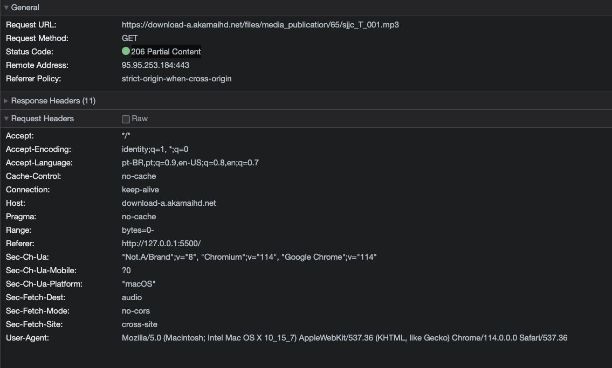

# Introdução

Eu gerei a tradução pelo chatgpt, então, não enche, e vá lê a versão original que eu escrevi em inglês. :P

---

Antes de começar o projeto, tenho algumas perguntas sobre streaming de música no navegador.

1. Quando uso a tag `<audio>` com uma tag `<source>`, ela vai baixar o arquivo de música inteiro ou me dar pedaços dele?

2. Ela começará a baixar quando eu clicar no botão de reprodução?

3. Como posso enviar pedaços de áudio para o cliente?

4. Posso usar a tag `<audio>` para fazer streaming?

# Vamos testar passo a passo

## 1. Quando uso a tag `<audio>` com uma tag `<source>`, ela vai baixar o arquivo de música inteiro ou me dar pedaços dele?

Para descobrir, vou criar um HTML simples e encontrar uma música aleatória na internet para testar.

Podemos ver os cabeçalhos nesta imagem:


Podemos ver que o navegador começa a enviar a solicitação com o cabeçalho "Range" e o servidor responde com o código de status 206, o que significa "conteúdo parcial".

Observação: O servidor precisa suportar o cabeçalho "Range", caso contrário, o navegador solicitará o arquivo inteiro.

O cabeçalho "Range" na solicitação é: `bytes=0-`, o que significa que o navegador deseja os bytes do 0 até o final do arquivo.

Portanto, a resposta é: o navegador solicita o arquivo inteiro, mas o servidor responde com o conteúdo parcial usando uma conexão "keep-alive".

### Perguntas adicionais:

Com base na pergunta 01, o conteúdo parcial é fornecido pelo servidor ou pelo navegador?

A resposta é: servidor.

Outra pergunta: Se o navegador solicita o arquivo inteiro e o servidor responde com o conteúdo parcial (COM ZERO BYTES), como o navegador sabe a duração da música?

A resposta é: O navegador solicitará o arquivo inteiro, mas o servidor responderá com o conteúdo parcial e o cabeçalho "Content-Length", que indica o tamanho do arquivo.

Por exemplo, veja os cabeçalhos de resposta:

```http
Accept-Ranges: bytes
Connection: keep-alive
Content-Disposition: attachment; filename="sjjc_T_001.mp3"
Content-Length: 5120086
Content-Type: audio/mpeg
Date: Mon, 26 Jun 2023 22:54:25 GMT
```


Portanto, audio/mpeg tem 5120086 bytes, o que equivale a 5,12 MB.

Como posso saber a duração do áudio?
https://developer.mozilla.org/en-US/docs/Web/API/AudioBuffer/duration

Aqui está outra maneira de calcular a duração de um arquivo de áudio no formato audio/mpeg:

1. Determine o tamanho do arquivo do áudio MPEG em bytes.

2. Obtenha a taxa de bits (bit rate) do arquivo de áudio em kilobits por segundo (kbps). Você geralmente pode encontrar essa informação nos metadados ou nas especificações do arquivo.

3. Converta o tamanho do arquivo de bytes para kilobits. Divida o tamanho do arquivo por 8 para convertê-lo para kilobits, já que há 8 bits em um byte.

4. Calcule a duração usando a fórmula:

   duração = tamanho do arquivo (em kilobits) / taxa de bits (em kilobits por segundo)

Nosso arquivo tem 5120086 bytes, então precisamos converter para kilobits, então:

duração = 5120086 bytes * 0,008 = 40960,688 kilobits

duração = 40960,688 / 256 kbps** = 160 segundos

duração = 160 segundos = 2,6666 minutos = 2 minutos e 39 segundos

** Uma taxa de bits de 256 kbps é considerada uma configuração de qualidade relativamente alta para áudio MP3. Nessa taxa de bits, o áudio é codificado com um nível mais alto de detalhes, resultando em uma representação mais clara e precisa do som original. No entanto, também resulta em tamanhos de arquivo maiores em comparação com taxas de bits mais baixas.

Outra pergunta:

Como o navegador sabe se a taxa de bits é 256 kbps?

`A resposta está pendente`

A faixa de bytes é fornecida pelo servidor ou pelo navegador?

A resposta é: servidor nos cabeçalhos de resposta.

## 2. Ela começará a baixar quando eu clicar no botão de reprodução?

Sim, como mencionado na pergunta anterior, o navegador solicitará o arquivo inteiro, mas o servidor responderá com o conteúdo parcial. Portanto, se o arquivo tiver 9 MB, o navegador baixará 9 MB, mas o servidor responderá com 1 MB e o navegador solicitará o próximo 1 MB e assim por diante.

No meu exemplo, o navegador estava configurado para simular uma conexão "fast 3G", então o navegador solicitaria 9 MB, mas o servidor responderia com 100 KB.

## 3. Como posso enviar pedaços de áudio para o cliente?

`A resposta está pendente`

Exemplificarei isso na pasta "backend", mas encontrei um problema com o "content-length":
Problema: https://github.com/fastify/fastify/issues/4382

Enquanto não encontro uma solução, usarei o Express para exemplificar.

Você pode ver o exemplo na pasta "backend2".

### Instruções

```bash
docker-compose up -d
```

e abra o http://localhost:8080/ em seu navegador e clique no botão de reprodução.

Você verá o seguinte:



O navegador solicitará o arquivo inteiro, mas o servidor responderá com o conteúdo parcial. Após clicar em reproduzir, ele começará a baixar o restante do arquivo pedaço por pedaço, mas você poderá ouvir a música.

4. Posso usar a tag `<audio>` para fazer streaming?
Sim, você pode usar a tag `<audio>` para fazer streaming de música.

# Referências:

https://developer.mozilla.org/en-US/docs/Web/HTML/Element/audio

https://developer.mozilla.org/en-US/docs/Web/API/MediaSource

https://developer.mozilla.org/en-US/docs/Web/API/Web_Audio_API

http://mpgedit.org/mpgedit/mpeg_format/MP3Format.html
